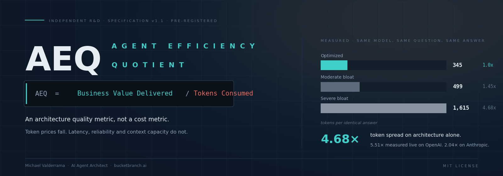
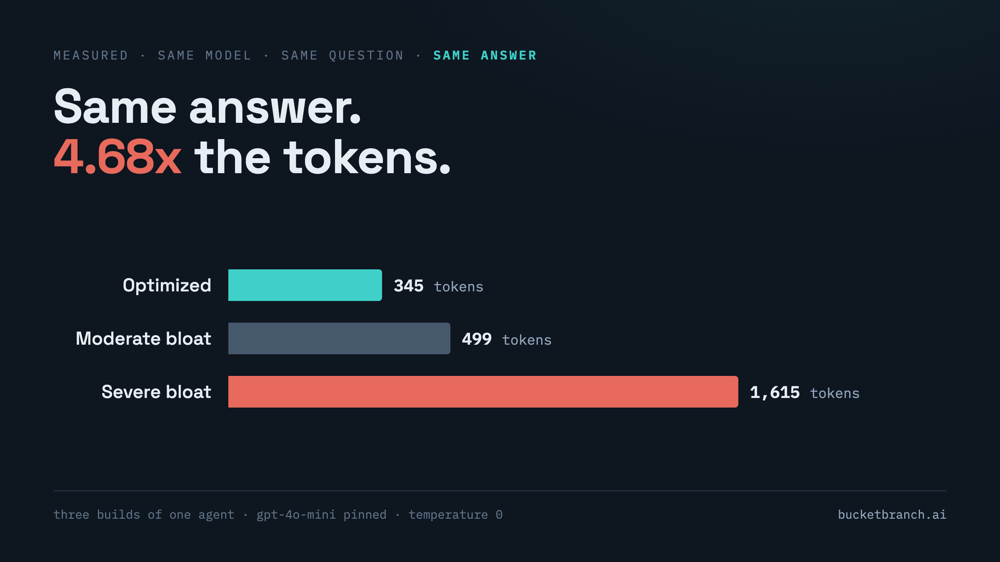
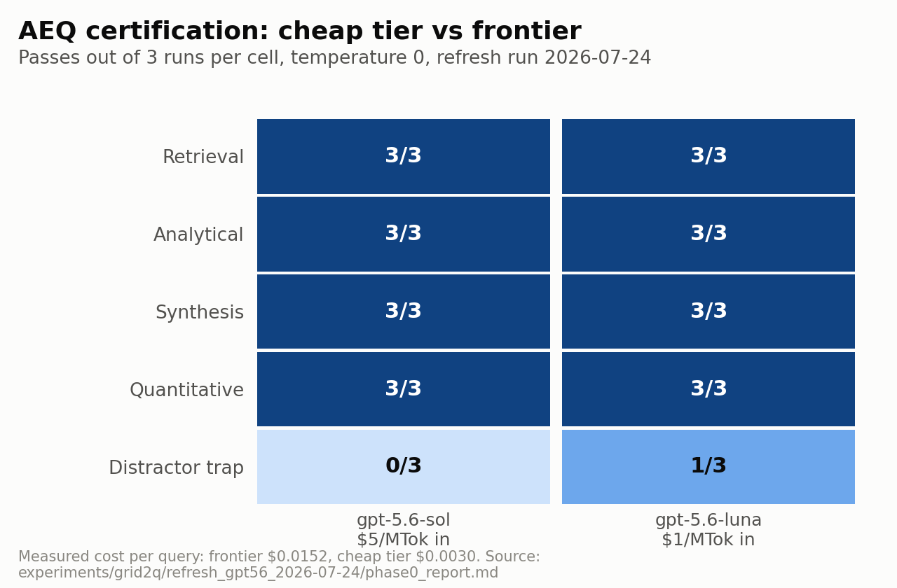

<div align="center">



**Two agents. Same model, same question, same answer. One spent 4.68× the tokens.**

[](spec/AEQ_Specification_v1.1.md)
[](preregistrations/)
[](results/aeq_dual_results.txt)
[](LICENSE)
[](https://medium.com/@michael_valderrama/same-model-same-question-4-68x-the-tokens-455725b06add)

</div>

---

## The problem this measures

Cost-per-token tells you what a benchmark run cost. It does not tell you what your
architecture wastes. Two teams on identical hardware running the same model get different
economics, because the workload sets the bottleneck. One layer up, the agent's own design decides how many tokens ever needed to move.

Accuracy gets benchmarked on every model release. Efficiency almost never does.

**AEQ is the missing number.**

```
AEQ  =  Business Value Delivered  /  Tokens Consumed
```

An architecture quality metric, not a cost metric. The numerator is held constant by an
equivalence rubric: two runs are compared only when they deliver the same substantive answer.
When the value is equal, the token delta between architectures is architectural waste by
construction. Nothing else is left for it to be.

Token prices keep falling. Three things do not get cheaper: **latency** compounds across
chained agent steps, **reliability** degrades when instructions sit buried in noise, and
**context capacity** is finite, so every wasted token displaces real work.

---

## What was measured

Same model (pinned version), temperature 0, same query. Three architectures, all returning the
same substantive answer under a rubric fixed before the runs.

| | Optimized | Moderate bloat | Severe bloat |
|---|---:|---:|---:|
| System prompt tokens | 48 | 87 | 475 |
| Total tokens | 345 | 499 | 1,615 |
| Tool calls | 1 | 1 | 3 |
| Prompt overhead | 13.9% | 17.4% | 29.4% |
| **Token ratio** | **1.0×** | **1.45×** | **4.68×** |
| Cost ratio | 1.0× | 1.79× | 5.04× |



Then validated live on two vendors, five runs per architecture at temperature 0:

| Vendor | Tokens | Cost | Latency |
|---|---:|---:|---:|
| OpenAI | 5.51× | 4.97× | 2.6× |
| Anthropic | 2.04× | 2.61× | 1.81× |

The pattern holding on **both** vendors is what makes this a property of the architecture
rather than a quirk of one model.

### The finding that wasn't planned

Reliability moved with the bloat. Across five identical calls at temperature 0, the severe
build agreed with itself on the critical-asset list **3 of 5 times**. The optimized build
agreed **5 of 5** on both vendors.

A padded prompt is not a safety blanket. It is a place to hide the instruction that mattered.

### And the honest caveat

The effect is not uniform. On an easy query with a cheap model, the spread between the
optimized and moderate builds compressed to 1.15–1.26× live, because the model quietly
compensates for a padded prompt when the task is simple. It stops compensating the moment
orchestration forces the waste.

**Prompt bloat is survivable. Forced orchestration bills you.**



---

## The three layers

AEQ decomposes waste into layers you can fix independently.

| Layer | What it measures | How to measure it |
|---|---|---|
| **Prompt** | System-prompt tokens as a share of total, the overhead paid on every single query | One tokenizer call and a division, before any API call |
| **Orchestration** | Calls, retries, and re-derivation beyond what the query required | Tool calls made vs. the minimum needed |
| **Output** | Verbosity beyond what the answer requires | Capped baseline vs. uncapped, same content |

You can measure all three on your own agent this week without a vendor dashboard.

---

## Repository map

| Path | Contents |
|---|---|
| [`spec/`](spec/) | The canonical specification, v1.1, markdown and PDF |
| [`preregistrations/`](preregistrations/) | The full pre-registration series. Every amendment dated before the run it governs |
| [`results/`](results/) | Study design and measured run output |
| [`runs/`](runs/) | Run records and dashboards, six experiment phases |
| [`figures/`](figures/) | Published figures |
| [`AEQ_Lessons_Ledger.md`](AEQ_Lessons_Ledger.md) | Every defect the method caught in itself. Append-only |

**Start here:** [the specification](spec/AEQ_Specification_v1.1.md), then
[the lessons ledger](AEQ_Lessons_Ledger.md).

---

## Why you should trust the numbers

The method was built to be hard on itself.

**Pre-registration before execution.** Query classes, rubrics, gates, and priors were
registered before each run. Amendments are timestamped ahead of the run they govern.
Improvements never touched a live run.

**A calibration gate.** No rubric certifies anything until it has demonstrably failed a
weaker system. The first rubric passed everything and was discarded for exactly that reason. A
test everything passes certifies nothing.

**Cross-family judging.** An Anthropic judge scores OpenAI candidates and vice versa, never
same-family. Every FAIL verdict is independently re-adjudicated, because a judge is a
measurement device and needs its own error model.

**Deprecation and pricing hygiene.** Models and prices are re-verified against official pages
before publication. A result on a model a reader cannot access or price is a demo, not
evidence.

**An eleven-entry ledger of self-caught defects.** Including the trap that fooled the frontier
model 3 of 3 times, and the run where a 4-bit quantized 3B model passed cells its own fp16
parent failed. Capability is per-workload, not per-parameter-count.

---

## Scope and limits

- The evidence base is five query classes, one registered query per class, three runs per cell at temperature 0. That is an existence proof about one workload, not a population statistic. What makes it evidence is the pre-registered bar and the calibration gate.
- AEQ is validated on **single-turn** interactions, where the minimum necessary work is knowable in advance. The loop extension (AEQ-L, spec §9) is a **proposal awaiting measurement** not a finding.
- Headline input token counts are tokenizer-exact. Output counts in the simulated comparison were estimated, disclosed as estimates, then validated against live API runs.
- AEQ can be gamed by weakening the verification gate. That is why the gate is defined outside the team optimizing the number.

---

## What's here and what isn't

This repo contains the specification, the pre-registration series, the run records, and the
lessons ledger. That is everything needed to understand the method, follow the reasoning, and check
the results.

Not published: the experiment harness, the reference agent implementation, and the rubric
authoring used in client engagements.

**If you want AEQ run against your own agent workload, or want the harness rather than the
method:** [LinkedIn](https://www.linkedin.com/in/m-valderrama/) · [X @mikevalderrama](https://x.com/mikevalderrama) · [bucketbranch.ai](https://bucketbranch.ai)

---

## Citing

> Valderrama, M. (2026). *AEQ: Agent Efficiency Quotient, specification, pre-registration
> series, and run reports.* https://github.com/ibucketbranch/AEQ

- Plain-language writeup: [Same Model, Same Question, 4.68× the Tokens](https://medium.com/@michael_valderrama/same-model-same-question-4-68x-the-tokens-455725b06add)
- Full methodology and white paper: [The Cost of a Question](https://bucketbranch.ai/papers/cost-of-a-question/)
- System architecture reference (v2.1.0): [Agentic Architecture for Enterprise Asset Management](https://bucketbranch.ai/papers/agentic-architecture-enterprise-eam/)
- Agent-loop economics reference: [bucketbranch.ai/reference/agent-loop-economics](https://bucketbranch.ai/reference/agent-loop-economics/)

---

<div align="center">

**Michael Valderrama** · AI Agent Architect · Independent R&D © 2026

*Token prices will keep falling. Your waste ratio stays exactly where your architecture put it.*

</div>
